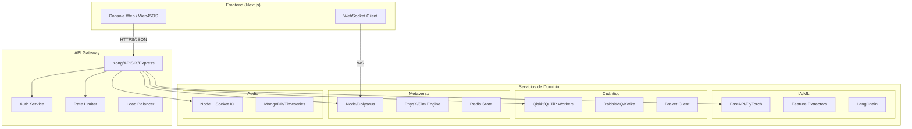

# **PROMETEO: COMPENDIO INTEGRAL DE CÓDIGO Y ARQUITECTURA**  
**Edición v0.1 — Ecosistema Web 4.5 / Metaverso Musical Cuántico**  

Autor: Equipo Prometeo (compilado por tu asistente)  
Licencia: MIT (para los snippets y plantillas aquí incluidos; revisa licencias originales de terceros).

---

## Prólogo

Este libro organiza y consolida los fragmentos de código, estructuras, plantillas y esquemas
arquitecturales del ecosistema Prometeo en un formato curado y listo para iterar. Incluye
capítulos por dominios (Frontend, Backend, IA/ML, Cuántico, Audio, DevOps, Seguridad, Web3/ZK, etc.),
con piezas listas para copiar/pegar y explicaciones prácticas.

> Nota: Cuando el material original no se encontraba completo en nuestras notas, se han añadido
secciones "TODO / placeholders" para facilitar su continuidad.

---

## Tabla de Contenidos

- Parte I — Arquitectura General del Ecosistema
  - Cap. 1 — Monorepo, Microservicios y Diagrama Global
  - Cap. 2 — API Gateway con Rate Limiting y OpenAPI
  - Cap. 3 — Seguridad, Privacidad, DID/SSI y ZK
- Parte II — Frontend (React/Next.js, Web45OS, UI/UX)
  - Cap. 4 — Ultra UI: Componentes React robustos
  - Cap. 5 — Quantum Designer (HTML + Tailwind + Three.js)
- Parte III — Backend de Audio y Procesamiento
  - Cap. 6 — Plataforma de Audio de Producción (Node.js + Socket.IO)
  - Cap. 7 — Procesamiento de Audio Avanzado (PrometeoAudioProcessor)
- Parte IV — IA/ML y Algoritmos
  - Cap. 8 — DeepLearningEngine (Transformer simplificado)
  - Cap. 9 — Módulos musicales (HarmonyRNN / GenreAnalyzer) — blueprint
- Parte V — Cómputo Cuántico e Integraciones
  - Cap.10 — QuTiP/Qiskit: bases y microvalidación de fuentes de fotones — blueprint
- Parte VI — DevOps, CI/CD y Observabilidad
  - Cap.11 — K8s/Helm/Terraform — checklist y plantillas
- Parte VII — Casos de Uso Extendidos
  - Cap.12 — App P2P para Construcción integrada al ecosistema
- Anexos
  - A — ADR / Runbook / Checklists
  - B — OpenAPI.yaml (ejemplo) y Gateway Express
  - C — Estructura Prometeo ZK Suite (monorepo)

---

## Parte I — Arquitectura General del Ecosistema

### Capítulo 1 — Monorepo, Microservicios y Diagrama Global

#### 1.1. Principios de diseño
- Separación de preocupaciones por dominios (IA, Cuántico, Audio, Metaverso, Gateway).
- Comunicación a través de un API Gateway con contratos bien definidos (OpenAPI).
- Observabilidad desde el día 0 (logs estructurados, métricas, trazas).
- Seguridad por defecto (authN/authZ, rate limiting, validación de entrada).
- Iteración incremental (MVP → hardening → ultra-rendimiento).

#### 1.2. Estructura de alto nivel (propuesta)
```text
prometeo/
├─ apps/
│  ├─ console-web/                 # Web45OS / UI
│  └─ p2p-construction/            # Caso de uso P2P Construcción
├─ services/
│  ├─ gateway/                     # API Gateway (Express/Kong/APISIX alt.)
│  ├─ ai/                          # IA/ML (FastAPI/PyTorch; LangChain opc.)
│  ├─ quantum/                     # Workers/cuántico (Qiskit/QuTiP/Braket)
│  ├─ metaverse/                   # Colyseus/Node; estado en Redis
│  └─ audio/                       # Plataforma de audio (Node + Socket.IO)
├─ contracts/
│  ├─ openapi/                     # Especificaciones OpenAPI
│  └─ python/                      # Pydantic models, DTOs
├─ platform/
│  ├─ gateway/                     # Config gateway (Kong/APISIX)
│  ├─ k8s/                         # Manifests K8s
│  ├─ helm/                        # Charts
│  └─ terraform/                   # Infra como código
└─ ops/
   ├─ ci/                          # GitHub Actions
   └─ observability/               # Prometheus/Grafana/Tempo/Loki
```

#### 1.3. Diagrama conceptual (Mermaid)


### Capítulo 2 — API Gateway con Rate Limiting y OpenAPI

El Gateway centraliza autenticación, control de tráfico y versionado de APIs.
Incluye validación de entrada/salida y documentación viva con OpenAPI.

**Archivo clave:** `services/gateway/server.ts` (ver Anexo B para el código).

Puntos esenciales:
- `express-rate-limit` con sensibilidad por IP/token/usuario.
- Middlewares de seguridad (helmet, cors).
- Validación de esquemas (Zod/Joi) y manejo centralizado de errores.
- Healthchecks `/health` y `/ready`.
- Rutas **/ai**, **/quantum**, **/metaverse**, **/audio**, **/p2p** con proxies o handlers finos.
- OpenAPI.yaml versionado en `contracts/openapi/gateway.yaml`.

### Capítulo 3 — Seguridad, Privacidad, DID/SSI y ZK

- Identidad descentralizada (DID/SSI) con emisión/validación de credenciales verificables (VC).
- Pruebas de conocimiento cero (ZK) para preservar privacidad en autenticación y pruebas de pertenencia.
- Cifrado extremo a extremo y telemetría anonimizada (donde aplique).
- Registro de auditoría append-only y minimización de datos.
- Ver Anexo C para estructura de **Prometeo ZK Suite** (monorepo base).

## Parte II — Frontend (React/Next.js, Web45OS, UI/UX)

### Capítulo 4 — Ultra UI: Componentes React robustos

A continuación un componente base **UltraAIEngine** con correcciones a comillas, tipos y
estándares de calidad (memoización, limpieza de efectos, props tipadas):

```tsx
// apps/console-web/src/components/UltraAIEngine.tsx
import React, { useState, useEffect, useCallback, useMemo, useRef, memo } from "react";
import { Brain, Music, Settings, Activity, Zap } from "lucide-react";

type UltraAIEngineMode = "text" | "buildr";

type AIEngineProps = {
  prompt: string;
  mode?: UltraAIEngineMode;
  onResponse?: (txt: string) => void;
};

const UltraAIEngine: React.FC<AIEngineProps> = memo(({ prompt, mode = "text", onResponse }) => {
  const [running, setRunning] = useState(false);
  const [output, setOutput] = useState<string>("");
  const loopRef = useRef<number | null>(null);

  const processPrompt = useCallback((p: string) => {
    // TODO: integrar motor IA real vía Gateway (/ai/infer)
    return `[${mode.toUpperCase()}] → ${p.trim()}`;
  }, [mode]);

  const start = useCallback(() => {
    if (running) return;
    setRunning(true);
    const result = processPrompt(prompt);
    setOutput(result);
    onResponse?.(result);
  }, [running, processPrompt, prompt, onResponse]);

  const stop = useCallback(() => {
    setRunning(false);
    if (loopRef.current) {
      cancelAnimationFrame(loopRef.current);
      loopRef.current = null;
    }
  }, []);

  useEffect(() => {
    return () => { // cleanup
      if (loopRef.current) cancelAnimationFrame(loopRef.current);
    };
  }, []);

  return (
    <div className="rounded-xl border p-4 space-y-2">
      <div className="flex items-center gap-2">
        <Brain /> <span className="font-semibold">UltraAIEngine</span>
      </div>
      <div className="text-sm text-muted-foreground">Modo: {mode}</div>
      <pre className="bg-muted rounded p-3 overflow-auto">{output || "—"}</pre>
      <div className="flex gap-2">
        <button onClick={start} className="px-3 py-2 border rounded">Start</button>
        <button onClick={stop} className="px-3 py-2 border rounded">Stop</button>
      </div>
    </div>
  );
});

export default UltraAIEngine;
```

**Notas de calidad**
- Evitar comillas “curvas”; usar ASCII plano `"..."`.
- Limpiar timers/RAF en `useEffect` de desmontaje.
- Aislar lógica de negocio en servicios (fetchers) y mantener UI “tonta”.

### Capítulo 5 — Quantum Designer (HTML + Tailwind + Three.js)

Plantilla base (corrige comillas y cargas CDN). Ideal como **playground** visual:

```html
<!-- apps/console-web/public/quantum-designer/index.html -->
<!DOCTYPE html>
<html lang="es" class="dark">
<head>
  <meta charset="UTF-8" />
  <meta name="viewport" content="width=device-width, initial-scale=1.0" />
  <title>Quantum Designer - Proyecto Prometeo</title>
  <script src="https://cdn.tailwindcss.com"></script>
  <link href="https://fonts.googleapis.com/css2?family=Inter:wght@400;600;700&display=swap" rel="stylesheet" />
  <script src="https://cdnjs.cloudflare.com/ajax/libs/d3/7.9.0/d3.min.js"></script>
  <script src="https://cdnjs.cloudflare.com/ajax/libs/three.js/r128/three.min.js"></script>
  <script src="https://cdn.jsdelivr.net/npm/interactjs/dist/interact.min.js"></script>
  <script src="https://cdnjs.cloudflare.com/ajax/libs/gsap/3.12.5/gsap.min.js"></script>
</head>
<body class="bg-neutral-950 text-neutral-100">
  <main class="max-w-6xl mx-auto p-6 space-y-6">
    <header>
      <h1 class="text-3xl font-bold">Quantum Designer (Error‑Proof)</h1>
      <p class="text-neutral-400">Escenario para visualizar estados, jitter, decoherencia, etc.</p>
    </header>
    <section id="canvas" class="rounded-xl border h-[480px]"></section>
  </main>
  <script>
    const el = document.getElementById("canvas");
    const scene = new THREE.Scene();
    const camera = new THREE.PerspectiveCamera(75, el.clientWidth/el.clientHeight, 0.1, 1000);
    const renderer = new THREE.WebGLRenderer();
    renderer.setSize(el.clientWidth, el.clientHeight);
    el.appendChild(renderer.domElement);
    const geo = new THREE.SphereGeometry(1, 32, 32);
    const mat = new THREE.MeshNormalMaterial();
    const mesh = new THREE.Mesh(geo, mat);
    scene.add(mesh);
    camera.position.z = 3;
    function animate(){ requestAnimationFrame(animate); mesh.rotation.y += 0.01; renderer.render(scene, camera); }
    animate();
  </script>
</body>
</html>
```

## Parte III — Backend de Audio y Procesamiento

### Capítulo 6 — Plataforma de Audio de Producción (Node.js + Socket.IO)

Servidor base endurecido con seguridad y colas (simplificado):
```js
// services/audio/src/app.js
import express from "express";
import { createServer } from "http";
import { Server } from "socket.io";
import helmet from "helmet";
import cors from "cors";
import rateLimit from "express-rate-limit";

const app = express();
const server = createServer(app);
const io = new Server(server, { cors: { origin: "*" }, maxHttpBufferSize: 1e8 });

app.use(helmet({ contentSecurityPolicy: false }));
app.use(cors({ origin: process.env.ALLOWED_ORIGINS?.split(",") || ["http://localhost:3000"] }));
app.use(express.json({ limit: "10mb" }));

const limiter = rateLimit({ windowMs: 60_000, max: 120 });
app.use(limiter);

app.get("/health", (_req, res) => res.json({ ok: true }));

io.on("connection", (socket) => {
  socket.on("audio:chunk", (payload) => {
    // TODO: procesar frames, almacenar, extraer features
    socket.emit("audio:ack", { ts: Date.now() });
  });
});

server.listen(process.env.PORT || 8081, () => {
  console.log("Audio service ready on :8081");
});
```

### Capítulo 7 — Procesamiento de Audio Avanzado (PrometeoAudioProcessor)

Clase base (JS) para análisis y features; expandible con FFT/DSP real:

```js
// services/audio/src/PrometeoAudioProcessor.js
export class PrometeoAudioProcessor {
  constructor(sampleRate = 44100) {
    this.sampleRate = sampleRate;
    this.bufferSize = 4096;
    this.fftSize = this.bufferSize * 2;
  }
  // TODO: FFT real; g2(0) estimado; detección de pitch; timbre; onsets
  energy(frame) {
    return frame.reduce((acc, x) => acc + x * x, 0) / frame.length;
  }
  normalize(frame) {
    const max = Math.max(1e-9, ...frame.map(Math.abs));
    return frame.map(x => x / max);
  }
}
```

## Parte IV — IA/ML y Algoritmos

### Capítulo 8 — DeepLearningEngine (Transformer simplificado)

```ts
// services/ai/src/DeepLearningEngine.ts
export class DeepLearningEngine {
  config: Record<string, any>;
  models: Record<string, any>;
  trainingHistory: any[];
  constructor(config: Record<string, any> = {}) {
    this.config = config;
    this.models = {};
    this.trainingHistory = [];
  }

  initializeMatrix(rows: number, cols: number) {
    const m = Array.from({ length: rows }, () => Array.from({ length: cols }, () => (Math.random() - 0.5) * 0.02));
    return m;
  }

  createTransformer(inputSize: number, hiddenSize = 256, numHeads = 8) {
    return {
      inputSize,
      hiddenSize,
      numHeads,
      attention: {
        queryWeights: this.initializeMatrix(inputSize, hiddenSize),
        keyWeights: this.initializeMatrix(inputSize, hiddenSize),
        valueWeights: this.initializeMatrix(inputSize, hiddenSize),
      },
      feedForward: {
        w1: this.initializeMatrix(hiddenSize, hiddenSize),
        w2: this.initializeMatrix(hiddenSize, inputSize),
      },
    };
  }
}
```

### Capítulo 9 — Módulos musicales (HarmonyRNN / GenreAnalyzer) — blueprint

- **HarmonyRNN**: pérdidas personalizadas (disonancia/patrón), feedback armónico en tiempo real.
- **GenreAnalyzer**: CNN-RNN híbrido con pipeline de espectrogramas; exportación a TF.js para Web.
- **TODO:** Añadir dataset config, scripts de entrenamiento y validación cruzada; métricas SHAP.

## Parte V — Cómputo Cuántico e Integraciones

### Capítulo 10 — QuTiP/Qiskit: bases y microvalidación — blueprint

- Simulación de sistema de dos niveles con bombeo y decaimiento (QuTiP).
- Extensiones inmediatas: pureza g²(0), jitter, decoherencia térmica, escenario HOM.
- Preparación de estructura para auto-calibración vía ML.
- Integración con Qiskit/Braket para ejecución en hardware real (colas/worker).
- **TODO:** Añadir scripts `qutip_two_level.py` y `qiskit_runner.py` con colas RabbitMQ.

## Parte VI — DevOps, CI/CD y Observabilidad

### Capítulo 11 — K8s/Helm/Terraform — checklist y plantillas

- Imágenes con etiquetas inmutables, SBOM y escaneo (Trivy/Grype).
- Despliegues GitHub Actions → registry → ArgoCD/Flux.
- Liveness/Readiness probes, HPA/VPA, PodDisruptionBudgets.
- Dashboards: Prometheus (metrics), Loki (logs), Tempo (trazas).
- **TODO:** Añadir `ops/k8s/*.yaml`, Charts Helm y módulos Terraform base.

## Parte VII — Casos de Uso Extendidos

### Capítulo 12 — App P2P para Construcción integrada

- Marketplace P2P sin contratista intermediario: cliente ↔ profesional (membresía).
- Listado de trabajos, matching de skills, escrow de pagos, trazabilidad de progreso.
- Integración con DID/SSI (credenciales de habilidades), reputación y ZK‑proofs.
- Canales de pago tokenizados (opcional), auditoría on/off‑chain.
- **Rutas sugeridas (Gateway):**
  - `POST /p2p/jobs` crear trabajo
  - `POST /p2p/jobs/{id}/apply` postularse
  - `POST /p2p/jobs/{id}/milestones` avanzar progreso
  - `POST /p2p/payments/escrow` gestionar fondos

---

## Anexos

### Anexo A — ADR / Runbook / Checklists

**ADR (plantilla mínima)**
```md
# Título de la Decisión
Fecha: YYYY-MM-DD
Contexto: ...
Decisión: ...
Consecuencias: positivas/negativas
```

**Runbook (incidente Audio)**
```md
Señales: latencia WS > 250ms, pérdida de frames > 1%.
Acciones: escalar pods `audio`, verificar GC, revisar backpressure.
Métricas: p95, p99, dropped_frames, ws_retries.
Postmortem: causas raíz, acciones preventivas.
```

### Anexo B — Gateway Express (+ Rate Limiter) y OpenAPI.yaml

**`services/gateway/server.ts`**
```ts
import express from "express";
import helmet from "helmet";
import cors from "cors";
import rateLimit from "express-rate-limit";

const app = express();
app.use(helmet());
app.use(cors({ origin: "*" }));
app.use(express.json({ limit: "2mb" }));

const limiter = rateLimit({ windowMs: 60_000, max: 240 });
app.use(limiter);

app.get("/health", (_req, res) => res.json({ ok: true, service: "gateway" }));

app.post("/ai/infer", async (req, res) => {
  const { prompt, mode = "text" } = req.body || {};
  if (!prompt) return res.status(400).json({ error: "prompt requerido" });
  // TODO: proxy a servicio IA real
  return res.json({ output: `[${mode}] ${prompt}` });
});

app.listen(process.env.PORT || 8080, () => {
  console.log("Gateway ready on :8080");
});
```

**`contracts/openapi/gateway.yaml` (fragmento)**
```yaml
openapi: 3.0.3
info:
  title: Prometeo Gateway API
  version: "0.1.0"
paths:
  /health:
    get:
      summary: Healthcheck
      responses:
        "200":
          description: OK
  /ai/infer:
    post:
      summary: Inferencia IA (demo)
      requestBody:
        required: true
        content:
          application/json:
            schema:
              type: object
              properties:
                prompt: { type: string }
                mode: { type: string, enum: [text, buildr], default: text }
              required: [prompt]
      responses:
        "200":
          description: Respuesta
          content:
            application/json:
              schema:
                type: object
                properties:
                  output: { type: string }
```

### Anexo C — Estructura Prometeo ZK Suite (monorepo)

```text
prometeo-zk-suite/
├─ package.json
├─ pnpm-workspace.yaml
├─ tsconfig.json
├─ README.md
├─ scripts/
│  ├─ build-circuit.sh
│  ├─ setup-circuit.sh
│  └─ test-circuit.sh
├─ contracts/
│  ├─ Verifier.sol           # generado por snarkjs (placeholder)
│  └─ circuits/              # plantillas circom
├─ services/
│  └─ prover/                # microservicio para pruebas/verificaciones
└─ docs/
   └─ zk-flow.md
```
