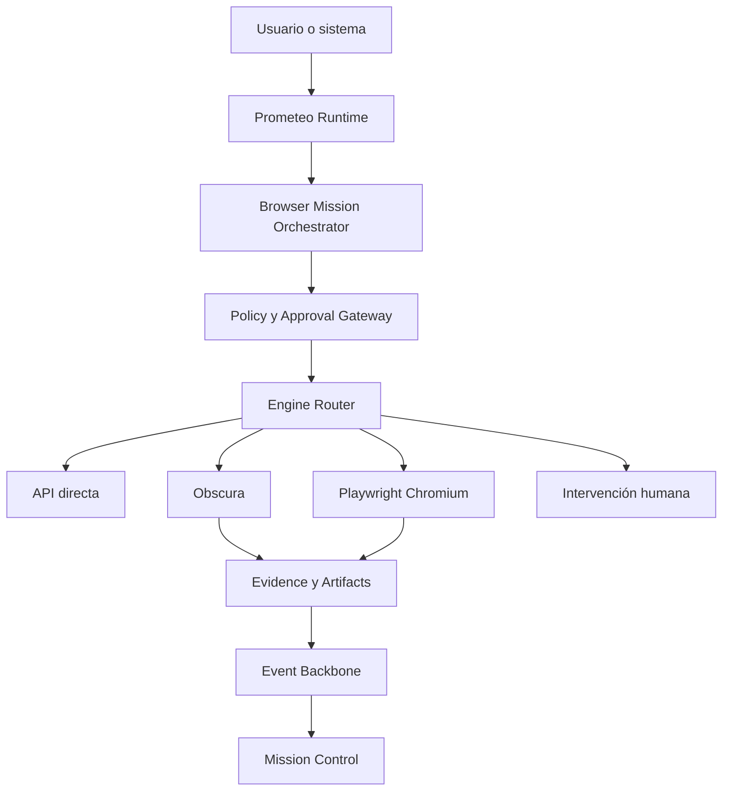

# ADR-022 — SEMSE Browser Agent & Web Operator: Plataforma de navegación y operación web gobernada basada en Obscura, Playwright e Intervención Humana

**Estado:** PROPOSED
**Fecha:** 2026-07-14
**Contexto de origen:** Tesis reforzada sobre la absorción de capacidades de Obscura como motor especializado dentro de una plataforma gobernada y multi-motor para SEMSEproject.
**Ubicación sugerida en repo:** `project-manager-app/docs/architecture/ADR-022-browser-agent-obscura.md`
**Relacionado con:** 
- [ADR-021 — Anatomía del Agente SEMSE](file:///home/yoni/labsemse/project-manager-app/docs/architecture/ADR-021-anatomia-agente-semse.md)
- [Arquitectura de Agentes SEMSE OS](file:///home/yoni/labsemse/project-manager-app/docs/specs/agents/SEMSE_AGENT_ARCHITECTURE.spec.md)
- [Harness Agentico](file:///home/yoni/labsemse/project-manager-app/docs/AGENTIC_HARNESS.md)
- [Spec: Verification Loop](file:///home/yoni/labsemse/project-manager-app/docs/specs/agents/verification-loop.spec.md)

---

## 1. Contexto y Visión General

SEMSEproject requiere capacidades avanzadas de navegación web para que sus agentes autónomos (especialmente **Prometeo** en tareas de investigación de precios, regulaciones, manuales, y validación de cotizaciones) operen en sitios web públicos. Sin embargo, no se debe clonar el código de navegadores headless ni construir otro producto independiente y aislado.

La solución reside en estructurar el **SEMSE Browser Agent** (o **SEMSE Web Operator**) como una capacidad central del sistema operativo SEMSE, gobernada y multi-motor, donde el navegador headless de código abierto en Rust **Obscura** actúa como el motor ligero preferente, con fallbacks coordinados a **Playwright (Chromium)** e **Intervención Humana** según los niveles de compatibilidad y riesgo.

Este diseño permite a SEMSEproject:
- Minimizar el consumo de recursos (Obscura requiere ~30 MB de RAM y arranca en milisegundos vs. >200 MB de Chrome).
- Mantener compatibilidad completa con sitios complejos mediante fallback dinámico a Playwright.
- Asegurar el gobierno y la seguridad frente a riesgos como Server-Side Request Forgery (SSRF) y Prompt Injection en contenido hostil.

---

## 2. Arquitectura de Navegación del Sistema

El agente de navegación no se acopla directamente a Prometeo; opera detrás de una capa de gateway y políticas, siguiendo el siguiente flujo arquitectónico:



### Tabla de Selección de Motores

| Motor | Criterio de Selección | Ventajas | Limitaciones |
| :--- | :--- | :--- | :--- |
| **DIRECT_API** | Primera opción si existe API oficial del proveedor | Máxima fiabilidad, bajo costo | Sujeto a la existencia y completitud de la API |
| **OBSCURA** | Lectura ligera, scraping estructurado a escala, investigación pública | Inicio inmediato, 30MB RAM, binario de 70MB | Incompatibilidad parcial con cookies complejas, DOM asíncrono pesado, infinite scroll |
| **PLAYWRIGHT** | Sitios SPA complejos, flujos que requieren renderizado visual/estricto | Compatibilidad web total | Mayor consumo de recursos (>200 MB RAM), requiere Node/Chrome |
| **HUMAN** | CAPTCHAs, firmas de contratos, pagos sensibles o pasarelas financieras | Seguridad absoluta, cumplimiento legal | Interrupción del flujo autónomo |

---

## 3. Especificación de los 24 Sistemas Core

### 1. Browser Mission Orchestrator
El coordinador central del ciclo de vida de la misión de navegación. Recibe las intenciones en lenguaje natural de Prometeo Runtime P2, las traduce a un plan estructurado, selecciona el motor inicial, monitoriza el presupuesto y gestiona los reintentos.
- *Estados de Misión:* `DRAFT`, `PLANNED`, `WAITING_POLICY`, `WAITING_APPROVAL`, `QUEUED`, `RUNNING`, `WAITING_HUMAN`, `VERIFYING`, `COMPLETED`, `PARTIAL`, `FAILED`, `CANCELLED`, `EXPIRED`.

### 2. Browser Engine Registry
Registro centralizado que expone la disponibilidad, estado de salud y capacidades de cada motor.
- *Atributos Declarados:* Versión, soporte de JavaScript, screenshots, descargas, compatibilidad CDP, y scoring de riesgo.

### 3. Browser Compatibility Router
Detecta incompatibilidades técnicas (DOM vacío, fallos en peticiones XHR, cookies no persistidas, desafíos antibot) y orquesta el fallback inteligente de Obscura a Playwright o Humano.

### 4. Browser Session Manager
Garantiza el aislamiento estricto de sesiones por cada misión y tenant. Limpia cookies, local storage e historial al finalizar, asegurando que los datos privados nunca se compartan entre diferentes ejecuciones.

### 5. Browser Policy Engine
El gateway de control de accesos. Evalúa la combinación de actor, tenant, dominio, URL y acción contra políticas de seguridad antes de autorizar cualquier paso.
- *Resultados:* `ALLOW`, `DENY`, `REQUIRE_APPROVAL`, `REQUIRE_HUMAN`, `REQUIRE_STEP_UP`.

### 6. Approval Gateway
Interface integrado con Mission Control para solicitar autorización explícita antes de ejecutar mutaciones (formularios, logins). Liga la aprobación criptográficamente a `missionId + stepId + actionHash + userId + expiresAt`.

### 7. Secure Network Gateway
Egresa todo el tráfico a través de un proxy que bloquea rangos de IP privados, localhost, metadata cloud (bloqueo SSRF) y realiza validación DNS estricta.
- *Rangos prohibidos:* `127.0.0.0/8`, `10.0.0.0/8`, `172.16.0.0/12`, `192.168.0.0/16`, `169.254.0.0/16`, `::1`, `fc00::/7`, `fe80::/10`, y protocolos peligrosos (`file://`, `ftp://`).

### 8. Browser Sandbox Runtime
Entorno de ejecución aislado para Obscura y Playwright. Contenedor sin privilegios de root, filesystem de solo lectura (con `/tmp` efímero), sin acceso al socket de Docker ni bases de datos generales.

### 9. Untrusted Content Firewall
Filtro de seguridad que analiza el DOM y contenido extraído de la web para interceptar posibles ataques de Prompt Injection indirecto, sanitizando el texto antes de entregarlo a los modelos de lenguaje de Prometeo.

### 10. Browser Tool Registry
Define y expone las herramientas autorizadas del navegador ordenadas por riesgo:
- *Lectura (Bajo):* `browser.navigate`, `browser.get_markdown`, `browser.query`, `browser.get_network_log`.
- *Interacción (Medio):* `browser.click`, `browser.fill`, `browser.select`, `browser.press_key`.
- *Mutaciones (Alto):* `browser.submit`, `browser.login`, `browser.send_message`.
- *Prohibidas (Ejecución Autónoma):* `browser.pay`, `browser.sign_contract`, `browser.delete_account`.

### 11. CDP Gateway
Interpone autenticación y control de rate limits delante del puerto de Chrome DevTools Protocol (CDP) expuesto por Obscura, evitando accesos no autorizados a la sesión del navegador.

### 12. MCP Gateway
Conecta los servidores Model Context Protocol (MCP) de Obscura controlando los scopes, evitando el "confused deputy" y garantizando auditoría inmutable de todas las llamadas.

### 13. Network Recorder y HAR
Registra de forma redactada las peticiones y respuestas de red (XHR/Fetch) de cada sesión para diagnóstico, auditoría de datos, y generación de evidencias de scraping.

### 14. Extraction and Distillation Engine
Procesa el DOM extraído, eliminando scripts, estilos y metadatos irrelevantes. Genera salidas destiladas en texto limpio, tablas estructuradas o Markdown semántico optimizado para LLMs.

### 15. Evidence Capture
Guarda evidencias criptográficas de cada navegación (DOM Snapshot, hashes de red, timestamps e imágenes) y las registra en el Evidence Center de SEMSE.

### 16. Artifact Storage
Estructura un almacenamiento aislado en buckets (namespaces) seguros para descargas, snapshots y logs de red, con escaneo automático de virus y control de retención de datos.

### 17. Download Security
Inspecciona y valida cada archivo descargado (verificación de MIME real, límite de tamaño, escaneo antivirus) antes de su almacenamiento definitivo, protegiendo al sistema contra Zip Slip y bombas de compresión.

### 18. Secrets and Credential Broker
Maneja la inyección controlada de credenciales e identidades efímeras en el navegador durante tareas de login autorizadas, asegurando que las contraseñas reales nunca queden expuestas en prompts o logs.

### 19. Queue and Worker Runtime
Utiliza BullMQ y Event Backbone para orquestar los pasos de navegación de forma asíncrona, tolerando fallos y permitiendo retries y backoffs exponenciales.

### 20. Event Catalog
Define el esquema y contratos de eventos para el Event Backbone F1, permitiendo la trazabilidad en tiempo real (ej. `browser.mission.created.v1`, `browser.navigation.completed.v1`, `browser.engine.fallback.v1`).

### 21. Browser Digital Twin
Muestra visualmente en Mission Control el estado de la sesión, consumo de RAM, logs de red y snapshots del navegador en tiempo real, permitiendo acciones manuales de parada de emergencia.

### 22. Compatibility Laboratory
Suite de testeo continuo que ejecuta y compara a Obscura y Playwright contra un corpus de páginas controladas (React, Vue, infinite scroll, cookies) para actualizar la matriz de enrutamiento.

### 23. Browser Product Intelligence
Métricas de negocio integradas con PI-00/PI-01 para reportar la tasa de éxito, fricción en aprobaciones, consumo de tokens y ahorro de costos al preferir Obscura sobre Playwright.

### 24. Licensing and Supply Chain
Garantiza el cumplimiento de la licencia Apache 2.0 de Obscura, controlando la atribución, mantenimiento de avisos, firma del binario y escaneo de vulnerabilidades (CVE) en sus dependencias Rust.

---

## 4. Modelos de Datos (Prisma/DB)

Se definen los siguientes modelos base para persistencia en `packages/db/prisma/schema.prisma`:

```prisma
model BrowserMission {
  id           String               @id @default(cuid())
  tenantId     String
  actorId      String
  status       String               // DRAFT | PLANNED | RUNNING | COMPLETED | FAILED ...
  goal         String
  budgetLimit  Float                // Límite de costo en tokens/infra
  budgetSpent  Float                @default(0.0)
  createdAt    DateTime             @default(now())
  updatedAt    DateTime             @updatedAt
  steps        BrowserMissionStep[]
  sessions     BrowserSession[]
}

model BrowserMissionStep {
  id          String         @id @default(cuid())
  missionId   String
  mission     BrowserMission @relation(fields: [missionId], references: [id])
  stepNumber  Int
  actionType  String         // navigate | click | fill | extract ...
  parameters  Json
  engineUsed  String         // OBSCURA | PLAYWRIGHT | DIRECT_API | HUMAN
  status      String         // PENDING | RUNNING | COMPLETED | FAILED
  error       String?
  evidenceRef String?
  createdAt   DateTime       @default(now())
}

model BrowserSession {
  id          String         @id @default(cuid())
  missionId   String
  mission     BrowserMission @relation(fields: [missionId], references: [id])
  engine      String
  startedAt   DateTime       @default(now())
  closedAt    DateTime?
  cookiesRef  String?        // Referencia a bóveda de cookies cifrada (nunca texto plano)
  logs        Json?
}
```

---

## 5. Matriz de Roles y Casos de Uso del Negocio

El Browser Agent se acopla a los verticales de SEMSE:

- **BuildOps & Estimaciones:** Búsqueda automática de cotizaciones de materiales en distribuidores públicos (ej. Home Depot), descarga de manuales técnicos, y análisis de precios regionales sin intervención del contratista.
- **SEMSE Agro (RanchOps):** Consulta de precios de insumos agrícolas en portales públicos de Honduras y EEUU, pronóstico climático especializado, y normativas sanitarias vigentes.
- **Marketplace Verification:** Validación del estatus legal e inscripción pública de contratistas en portales gubernamentales antes de abrir su onboarding en la plataforma.

---

## 6. Plan de Trabajo e Hitos (Roadmap OB-00 a OB-10)

```
OB-00 (Investigación y Cumplimiento)  ──> OB-01 (Engine Common Adapter)
                                                  │
                                                  ▼
OB-03 (Tools de Lectura Básica)       <── OB-02 (Sesiones y Aislamiento Sandbox)
          │
          ▼
OB-04 (Mission Runtime & BullMQ)      ──> OB-05 (Política y Flujos de Aprobación)
                                                  │
                                                  ▼
OB-07 (Compatibility Router & Fallback) <── OB-06 (Tools de Interacción y Modificación)
          │
          ▼
OB-08 (Mission Control Digital Twin)  ──> OB-09/OB-10 (Canary Deploy & Product Intelligence)
```

1. **OB-00 — Investigación y Licencia:** Redacción del Threat Model inicial y establecimiento del cumplimiento con la licencia Apache 2.0 de Obscura.
2. **OB-01 — Engine Adapter:** Interfaz unificada de adaptador para `OBSCURA`, `PLAYWRIGHT` y `DIRECT_API`.
3. **OB-02 — Sesiones y Sandbox:** Manager de sesiones efímeras y configuración de DNS/IP Gateway (SSRF protection).
4. **OB-03 — Tools de Lectura:** Implementación de `navigate`, `get_markdown` y registro de evidencias (Evidence capture).
5. **OB-04 — Mission Runtime:** Integración de la cola de navegación BullMQ y estados de misión con Prometeo.
6. **OB-05 — Política y Aprobaciones:** Implementación del Policy Gateway y tarjetas de aprobación humana en tiempo real.
7. **OB-06 — Interaction Tools:** Implementación de `click`, `fill`, `select` y soporte de formularios.
8. **OB-07 — Compatibility Router:** Lógica de degradación controlada de Obscura a Playwright.
9. **OB-08 — Mission Control:** Dashboard interactivo en tiempo real con logs y consola del navegador.
10. **OB-09 & OB-10 — Producción Gradual:** Despliegue en producción tipo canary, inicialmente restringido a dominios en una lista de permitidos y en modo de solo lectura.

---

## 7. Consecuencias

### Positivas
- **Ahorro de Cómputo Crítico:** Obscura reduce en ~85% la memoria en comparación con Playwright para el 70% de las páginas de lectura simple.
- **Alta Tolerancia a Fallos:** La arquitectura multi-engine previene que bloqueos o fallos en Obscura arruinen la misión del agente gracias al fallback inteligente.
- **Gobernanza Nativa:** Seguridad perimetral integrada contra SSRF e Injections desde el primer día.

### Negativas / Riesgos Aceptados
- **Complejidad en Mantenimiento:** Soportar dos motores web diferentes (Rust/V8 y Node/Chromium) aumenta el tamaño del código de mantenimiento del adaptador.
- **Latencia de Fallback:** Si una página falla en Obscura, el tiempo total de respuesta aumenta al tener que arrancar la sesión secundaria en Playwright.
- **Cuello de Botella en Aprobaciones:** Las acciones de mutación complejas exigen intervención humana o step-up, lo que pausa temporalmente la automatización de fondo.
