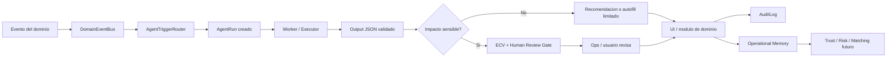
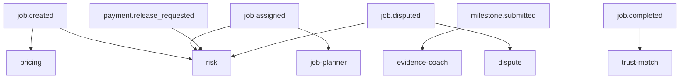
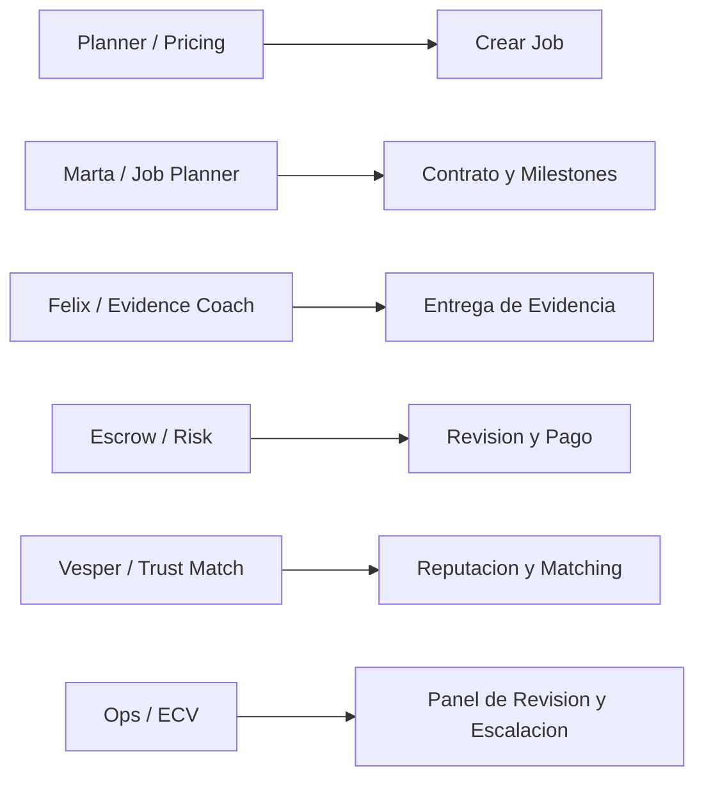

# SEMSE AI Event Flow

## Flujo principal

---

## Activadores principales

---

## Superficies de producto

---

## Regla de oro

La IA en SEMSE debe seguir este circuito:

**evento de dominio -> agente correcto -> output tipado -> validacion -> accion visible -> auditoria -> memoria**
