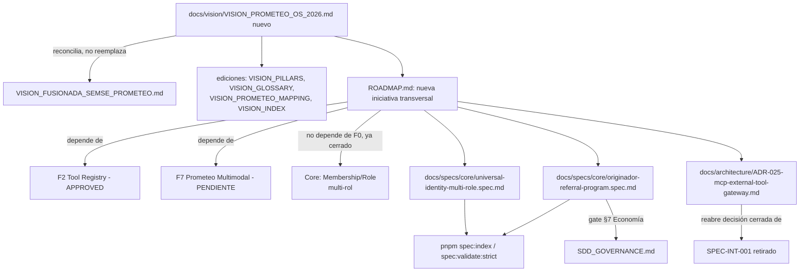

# Plan: outline de alineación "Prometeo OS" con el roadmap y el kit SDD

**Fecha:** 2026-08-03
**Tipo:** insumo previo al trabajo (ver `docs/reportes/planning/README.md`) — no es canon estructural, no reemplaza `docs/program/`.
**Estado:** outline para revisión humana. No ejecutado todavía.

## Contexto

En una sesión de voz, Samuel sintetizó una evolución de producto para SEMSE
Project: pasar de "módulos que el usuario aprende" a un "sistema operativo
conversacional" donde Prometeo interpreta la intención del usuario (texto,
voz, imagen o dashboard — todos clientes del mismo backend), decide qué
capacidades internas usar (Marketplace, BuildOps, Evidence, Payments, CRM,
Planner, Mission Control) y, eventualmente, qué herramientas externas
orquestar vía MCP (GitHub, Vercel, Railway, Docker, sandboxes) para dominios
fuera de construcción. Se añaden dos conceptos nuevos: (1) identidad única
con múltiples capacidades por proyecto ("una cuenta, múltiples capacidades,
cualquier proyecto") en vez de roles fijos, y (2) un rol "originador /
facilitador" que ayuda a un tercero a crear un proyecto y recibe una
recompensa atada a hitos verificables (no solo publicar).

El pedido explícito **no es código**: es alinear el "recibo conductor" del
desarrollo (`ROADMAP.md`) y el kit SDD (`docs/SDD_GOVERNANCE.md`) con esta
visión, para que el resto del repo (specs, roadmap, agentes) no quede
desalineado con lo que Samuel realmente quiere construir.

**Alcance de esta sesión:** producir este outline — qué documentos crear o
editar, con su estructura y contenido esperado — sin escribir todavía los
documentos finales de visión/roadmap/specs. Ejecutar este outline (redactar
esos archivos) queda para una sesión posterior, tras revisión.

## Verificación hecha antes de escribir este outline

Se leyeron directamente los archivos reales del repo (sin asumir memoria de
sesiones anteriores) para no proponer nada duplicado ni contradictorio:

- **El roadmap vive en `ROADMAP.md`, en la raíz de `project-manager-app/`**
  (no bajo `docs/`). Confirma las fases F0–F9 relevantes: F2 — Prometeo Tool
  Registry gobernado (gobernanza en `main`, PRs #369/#371/#372); F7 —
  Prometeo Multimodal, **PENDIENTE**; y la sección "Programa transversal —
  Consolidación Cognitiva (ADR-023)" donde ya consta que `SPEC-INT-001`
  (CLI Agent Adapter + MCP Gateway externo) está **retirado**, reemplazado
  por `packages/agents/src/developer-runtime.ts`.
- **F0 = "Sincronizar la verdad"** (COMPLETADO, revalidado 2026-07-28) — es
  un hito documental/arquitectónico, sin relación temática con identidad o
  roles. Cualquier cambio de identidad multi-rol no debe atarse a F0.
- **`docs/vision/*`** (12 documentos) define un Prometeo de 4 capas
  (Jobs/Ops/Trust/Prometeo) donde la capa Prometeo-DID/DAO/tesorería/
  gobernanza está **explícitamente fuera del MVP** — `VISION_DECISIONS_LOCKED.md:102`
  y `VISION_PILLARS.md:97` dicen literalmente "se conserva/preserva como
  norte institucional". Esta visión no reflexa el Prometeo orquestador
  conversacional que ya ejecuta trabajo hoy.
- **`docs/vision/VISION_CHANGE_PROTOCOL.md` fija dos reglas clave** que este
  outline debe respetar: (a) la fuente **canónica** de visión no es este
  repo — es un directorio externo (`vision/`, fuera de `project-manager-app/`),
  y `docs/vision/` es solo la "copia operativa" que debe reconciliarse con
  esa fuente (paso manual de Samuel, fuera del alcance de un agente en este
  entorno); (b) "regla de sobriedad" — no abrir documentos nuevos si solo
  reformulan lo mismo. El documento de síntesis propuesto abajo se justifica
  porque reconcilia una evolución real ya desplegada (Runtime P2), no una
  reformulación.
- **El núcleo conversacional-orquestador ya existe en código/specs**
  (julio 2026) sin que `docs/vision/` lo refleje: `docs/SEMSE_CONTEXT.md`
  documenta un Prometeo Runtime P2 desplegado con loop OBSERVE→INTERPRET→
  PLAN→APROBACIÓN→EXECUTE→VERIFY→LEARN. El Tool Registry gobernado está en
  `docs/specs/prometeo/tool-registry-governance.spec.md`
  (`status: APPROVED`, `risk: critical`). El ruteo de intención a agentes
  internos vive en `docs/specs/agents/prometeo-core.spec.md`
  (`status: DRAFT`, `risk: high`; ya referencia F2/F7 en su cabecera). Todo
  esto está acotado a módulos y herramientas internas de SEMSE — cero MCP,
  cero GitHub/Vercel/Railway/Docker.
- **Multicanal ya tiene precedente de diseño**:
  `docs/specs/ui/prometeo-multimodal-workspace.spec.md`
  (`status: IMPLEMENTED`) y
  `docs/specs/satellites/SAT-002-alexa-voice-channel.spec.md`
  (`status: APPROVED`, principio explícito "Alexa es solo otro cliente del
  mismo backend, no se migra nada"). F7 es el hueco natural para la capa
  multicanal completa (voz, cámara, video, streaming).
- **MCP externo ya se evaluó y se retiró** (ver arriba, `SPEC-INT-001`).
  `ADR-024` §12 propone un "MCP Gateway" para Obscura pero sin evidencia de
  implementación (confirmado por grep: 0 coincidencias de `mcp`/`sandbox`/
  `cdp` en `browser-agent.service.ts`). Revivir MCP no es agregar algo
  nuevo — es reabrir una decisión ya cerrada, y necesita su propio ADR.
- **Identidad universal multi-rol**: el schema (`packages/db/prisma/schema.prisma:405-415`,
  `Membership(userId, orgId, roleId)` con PK compuesta) ya permite
  técnicamente más de un rol por usuario/org a nivel de datos. El
  producto/UX asume hoy un rol fijo por sesión. No existe spec ni ADR para
  "una cuenta, múltiples capacidades".
- **Rol "originador/facilitador" con comisión por hito verificado**: no
  existe en ningún documento (el único hit de "originador" en `docs/` es un
  campo de contexto de Job no relacionado, en
  `docs/program/execution/SEMSE_AI_EXECUTION_BACKLOG.md:300`). Es alcance
  nuevo, toca dinero real (Stripe/escrow) y cae bajo el gate **§7 "Economía"**
  de `docs/SDD_GOVERNANCE.md` (separación payment provider/ledger, reversals
  inmutables, débitos=créditos).
- **Gobierno de specs**: `docs/SDD_GOVERNANCE.md` v2.0 exige el flujo
  `constitution → specify → clarify → plan → tasks → analyze → checklist →
  implement → validate → PR/CI → merge → deploy → activate → verify`, specs
  en `docs/specs/<domain>/<name>.{spec,plan,tasks,checklist}.md` usando
  `docs/specs/templates/semse-spec-template.md` (copia controlada del
  template real en `.specify/templates/overrides/semse-spec.md` — el
  validador falla si divergen), indexados en `docs/SPEC_INDEX.md` vía
  `pnpm spec:index` y validados con `pnpm spec:validate:strict` (ambos
  scripts confirmados en `package.json`). El orden de precedencia narrativo
  es `docs/program/MASTERPLAN.md` → `docs/program/ARCHITECTURE_TARGET.md` →
  `docs/program/ROADMAP_12_MESES.md` → `ROADMAP.md` (F0–F9) → specs.

## El outline

### A. Documento de síntesis de visión (nuevo, futuro)

- **Archivo:** `docs/vision/VISION_PROMETEO_OS_2026.md`.
- Encabezado obligatorio: nota de "copia operativa" señalando que la fuente
  canónica externa (`vision/`, fuera de este repo) debe reconciliarse
  manualmente por Samuel.
- Reencuadrar como **dos capas Prometeo con horizontes distintos**:
  *Prometeo Operativo* (orquestador conversacional ya en runtime P2, se
  extiende — horizonte: ahora) vs. *Prometeo Institucional* (DID/DAO/
  tesorería de `VISION_FUSIONADA_SEMSE_PROMETEO.md`, sin cambios, sigue de
  largo plazo).
- Contenido a incluir: los 5 principios centrales del brainstorm (el
  usuario nunca aprende módulos; una cuenta, múltiples capacidades,
  cualquier proyecto; los módulos son órganos, MCP es el sistema nervioso
  hacia afuera; ningún canal reemplaza a otro, se suman; el núcleo del
  proyecto es universal, la ejecución se especializa por industria); mapa
  canal→capacidad ya construido vs. pendiente (dashboard ✅, texto ✅ P2,
  multimodal-adjuntos ✅ `IMPLEMENTED`, voz nativa ⏳F7, visión-a-proyecto
  ⏳F7, MCP externo ⏳nuevo ADR); glosario nuevo: "originador/facilitador".
- Ediciones de reconciliación (no reescritura completa) en:
  `VISION_PILLARS.md`, `VISION_GLOSSARY.md` (términos nuevos),
  `VISION_PROMETEO_MAPPING.md` (actualizar sección 6 "Agentes Autónomos" y
  el resumen ejecutivo con el estado real de Runtime P2, ya no "futuro"),
  `VISION_INDEX.md`/`README.md` (enlazar el documento nuevo).

### B. Roadmap / "recibo conductor" (`ROADMAP.md` + `docs/program/*`)

- No reordenar F0–F9. Insertar como **iniciativa transversal nueva**
  (propuesta: **F10 — Identidad Universal y Orquestación Externa**, o
  "pista transversal" sin numerar si Samuel prefiere no tratarla como fase
  secuencial), siguiendo el mismo patrón ya usado en `ROADMAP.md` para
  "Programa transversal — Consolidación Cognitiva (ADR-023)".
- Dependencias explícitas hacia:
  - **F2 (Tool Registry)** — MCP externo se conecta ahí (mecanismo que ya
    sabe hacer approval/audit/policy), no aparte.
  - **F7 (Prometeo Multimodal)** — sigue dueño de voz/visión nativas; F10
    lo consume, no lo duplica.
  - **Sin dependencia hacia F0** — F0 ya está cerrado y trata de
    sincronizar documentación, no de identidad. El cambio de identidad
    multi-rol se referencia directamente contra el módulo Core
    (`Membership`/`Role` en `packages/db/prisma/schema.prisma`), no contra
    una fase F existente.
- Reflejar la misma referencia cruzada en `docs/program/ROADMAP_12_MESES.md`
  y `docs/program/ARCHITECTURE_TARGET.md`, para que el orden de precedencia
  narrativo no quede inconsistente.
- Añadir filas nuevas en `docs/architecture/IMPLEMENTATION_STATUS_MATRIX.md`
  en estado `PENDING`/`DRAFT` explícito — no marcar nada como implementado
  que no lo esté.

### C. Kit SDD — specs y ADR nuevos (todos en `status: DRAFT`)

Usar `docs/specs/templates/semse-spec-template.md` tal cual (12 secciones:
problema/resultado, alcance, actores/permisos, escenarios Gherkin,
contratos API/UI/Agente, FSM/eventos, datos/migración, observabilidad,
tests, mapa de implementación, investigación externa, gates de cierre).

1. **`docs/specs/core/universal-identity-multi-role.spec.md`**
   (+`.plan.md`/`.tasks.md`) — `domain: core`, `risk: high` (toca
   RBAC/tenant). Problema: un usuario no puede hoy ser cliente en un
   proyecto y profesional en otro sin fricción de rol, aunque el schema ya
   lo permite a nivel de datos (`Membership` PK compuesta
   `[userId, orgId, roleId]`). Alcance: extender el modelo a nivel de
   producto/UX (selector de capacidad por proyecto), no de schema. Fuera de
   alcance explícito: no tocar permisos financieros existentes sin spec de
   pagos aparte.
2. **`docs/specs/core/originador-referral-program.spec.md`** — `domain:
   core` o `payments` (a decidir con Samuel, toca dinero), `risk: critical`
   por el gate §7 "Economía" de `SDD_GOVERNANCE.md`. Debe declarar
   explícitamente los eventos que disparan recompensa (proyecto validado
   por dueño, primera propuesta, profesional contratado, primer milestone
   financiado, proyecto completado) y qué NO dispara pago (solo publicar).
3. **`docs/architecture/ADR-025-mcp-external-tool-gateway.md`** (siguiente
   número libre tras `ADR-024`) — decisión formal de si/cómo reabrir
   `SPEC-INT-001`. Debe citar por qué se retiró antes (`developer-runtime.ts`
   lo reemplazó) y qué cambia ahora para justificar revivirlo, con
   superficie de riesgo (scopes, confused deputy, auditoría inmutable — ya
   anticipado en `ADR-024` §12, sin evidencia de código). **Se documenta
   como decisión futura marcada, no como alcance activo** — el ADR queda en
   estado de propuesta, sin comprometer construcción inmediata.
4. **Actualizar** `docs/specs/agents/prometeo-core.spec.md` (sigue `DRAFT`):
   añadir una sección de "fuera de alcance por ahora" que referencie el ADR
   de MCP, para que quede explícito que el orquestador conversacional no
   gana herramientas externas hasta que ese ADR se apruebe.
5. Tras crear specs: correr `pnpm spec:index` (regenera
   `docs/SPEC_INDEX.md`) y `pnpm spec:validate:strict` (debe seguir en 0
   errores/0 warnings).

### D. Auditoría con extensiones (GitHub + Chrome) antes de dar esto por alineado

- **GitHub:** antes de escribir cualquier "ya existe X", confirmar contra
  `main` real (no memoria) — revisar si algo tocó `prometeo-core.spec.md`,
  `tool-registry-governance.spec.md` o `ROADMAP.md` desde la última
  lectura, y que ningún PR en curso ya cubra este mismo terreno.
- **Chrome:** verificar en la app en producción (`app.semseproject.com`)
  cuál es hoy el punto de entrada real del chat/Prometeo desde cada rol
  (cliente/profesional/admin), para que el documento de visión describa el
  punto de partida real, no supuesto. Si Chrome falla, documentar el estado
  a partir de los specs `IMPLEMENTED` en vez de bloquear la sesión.

## Verificación de la sesión que ejecute este outline

- `pnpm spec:validate:strict` y `pnpm spec:index` en verde tras crear los
  specs nuevos.
- Revisión humana explícita de cada documento nuevo/editado antes de mover
  cualquier spec de `DRAFT` a `APPROVED` — ninguno se auto-aprueba.
- Confirmar que `VISION_FUSIONADA_SEMSE_PROMETEO.md` y
  `VISION_DECISIONS_LOCKED.md` **no quedan contradichos** por el documento
  nuevo (deben poder coexistir citándose entre sí).
- Confirmar en GitHub que ningún PR reciente ya tocó estos mismos archivos
  antes de escribirlos.
